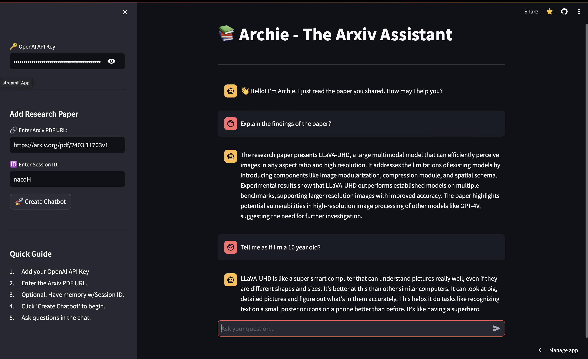

# Arxiv Research Paper Chatbot

Welcome to the Arxiv Research Paper Chatbot! This project is designed to assist users with understanding and interacting with research papers from Arxiv. The bot leverages Retrieval-Augmented Generation (RAG) techniques, incorporates memory, and utilizes the LangChain library for advanced language processing.

<br>
<br>



<br>

You can try the live demo ► [DEMO](https://rag-arxiv-bot-aezrygkhlj5jorueq2ayo6.streamlit.app).

<br>

## Features

- **Retrieval-Augmented Generation (RAG)**: Enhances the chatbot's ability to provide accurate and relevant information by retrieving and incorporating external knowledge from Arxiv papers.
- **Memory**: Remembers previous interactions to provide a more coherent and contextually aware conversation experience.
- **LangChain Integration**: Utilizes the LangChain library for sophisticated natural language processing and understanding.

<br>

## Setup

To set up the project, follow these steps:
```bash
# Clone the project
git clone https://github.com/tanmayjain98/RAG-arxiv-bot.git && cd RAG-arxiv-bot

# Environment
conda create --name rag-arxiv-bot python=3.10 -y
conda activate rag-arxiv-bot

# Install dependencies
pip install -r requirements.txt
```

## Usage

To run the Streamlit app, use the following command:
```bash
streamlit run streamlit_app.py
```

## Tech Stack

- **Programming Language**: Python
- **Libraries**: Streamlit, FAISS, PyPDF2
- **AI**: Langchain, RAGs, OpenAI

## Next Steps
**Evaluation**
- DeepEval

**Deployment**
- Dockerize
- KServe, vLLM
- Groq

